# 📋 Plano de Implementação: Context-Aware Logging para Tools

> **Versão:** 2.0 (Completo e Profissional)
> **Data:** 2025-12-06
> **Status:** ✅ **IMPLEMENTADO**
> **Autor:** Senior Developer Agent

---

## 📌 Sumário Executivo

Este plano descreve a implementação de um sistema de **Context-Aware Logging** que permite que logs criados pelo usuário dentro de tools customizadas sejam **automaticamente enriquecidos** com contexto de trace (`trace_id`, `run_id`) e **persistidos no TraceStore**, sem exigir mudanças na API existente.

### Princípios de Design

| Princípio                  | Aplicação                                                        |
| -------------------------- | ---------------------------------------------------------------- |
| **KISS**                   | Solução simples usando `ContextVar` nativo do Python             |
| **YAGNI**                  | Apenas funcionalidades necessárias, sem abstrações especulativas |
| **OCP**                    | Extensível sem modificar código existente                        |
| **DIP**                    | Dependência em interfaces, não implementações                    |
| **Backward Compatibility** | API `create_logger(__name__)` permanece idêntica                 |

---

## 🎯 Objetivos

### Funcionais

1. Logs em tools automaticamente correlacionados com `trace_id` e `run_id`
2. Persistência automática no `TraceStore` quando em contexto de trace
3. Funcionamento normal quando fora de contexto de trace (graceful degradation)
4. Suporte a tools síncronas e assíncronas
5. Isolamento de contexto em execuções paralelas

### Não-Funcionais

1. **Zero Breaking Changes** na API pública
2. **Performance**: Overhead mínimo (<1ms por log)
3. **Thread-Safety**: Isolamento correto via `ContextVar`
4. **Observabilidade**: Logs estruturados compatíveis com JSON

---

## 📊 Status de Implementação

### ✅ COMPLETADO

| Componente                          | Arquivo                                               | Status      |
| ----------------------------------- | ----------------------------------------------------- | ----------- |
| `ContextAwareLogger`                | `infra/config/logging/context_aware_logger.py`        | ✅ Completo |
| Modificar `create_logger()`         | `infra/config/logging/logging_config.py`              | ✅ Completo |
| Exportar em `__init__.py`           | `infra/config/logging/__init__.py`                    | ✅ Completo |
| Integrar contexto no `ToolExecutor` | `domain/services/tool_executor.py`                    | ✅ Completo |
| Atualizar `BaseHandler`             | `infra/adapters/Common/base_handler.py`               | ✅ Completo |
| Atualizar handlers Ollama           | `infra/adapters/Ollama/ollama_handler.py`             | ✅ Completo |
| Atualizar handlers Ollama Stream    | `infra/adapters/Ollama/ollama_stream_handler.py`      | ✅ Completo |
| Atualizar handlers OpenAI           | `infra/adapters/OpenAI/openai_handler.py`             | ✅ Completo |
| Atualizar handlers OpenAI Stream    | `infra/adapters/OpenAI/openai_stream_handler.py`      | ✅ Completo |
| Expor API pública                   | `tracing/__init__.py`                                 | ✅ Completo |
| Documentar evento `tool.log`        | `tracing/__init__.py`                                 | ✅ Completo |
| Adicionar `trace_store` à interface | `domain/interfaces/tracing/trace_logger_interface.py` | ✅ Completo |
| Tipagem correta de tokens           | `domain/value_objects/tracing/context_var.py`         | ✅ Completo |
| Testes unitários                    | `tests/unit/logging/test_context_aware_logger.py`     | ✅ Completo |

### 🔬 Validação

- ✅ **10/10 testes passando**
- ✅ **mypy sem erros**
- ✅ **ruff/ruff-format passando**
- ✅ **pydocstyle passando**

---

## 🏗️ Arquitetura da Solução

```
┌─────────────────────────────────────────────────────────────────────┐
│                         User Tool Code                              │
│   logger = create_logger(__name__)                                  │
│   logger.info("Processing data")  ──────┐                          │
└─────────────────────────────────────────┼───────────────────────────┘
                                          │
                                          ▼
┌─────────────────────────────────────────────────────────────────────┐
│                    ContextAwareLogger (NEW)                         │
│  ┌──────────────┐  ┌──────────────────┐  ┌───────────────────────┐ │
│  │ Base Logger  │  │ get_trace_context│  │ get_trace_store       │ │
│  │ (delegate)   │  │ (ContextVar)     │  │ (ContextVar)          │ │
│  └──────────────┘  └──────────────────┘  └───────────────────────┘ │
│         │                   │                      │                │
│         ▼                   ▼                      ▼                │
│  ┌─────────────────────────────────────────────────────────────┐   │
│  │  _enrich_and_log(level, msg, *args, **kwargs)               │   │
│  │  1. Call base logger (standard logging)                     │   │
│  │  2. If trace context exists:                                │   │
│  │     - Enrich extra with trace_id, run_id                   │   │
│  │     - Persist to TraceStore as 'tool.log' event           │   │
│  └─────────────────────────────────────────────────────────────┘   │
└─────────────────────────────────────────────────────────────────────┘
                                          │
                                          ▼
┌─────────────────────────────────────────────────────────────────────┐
│                       TraceStore                                    │
│  ┌─────────────────┐  ┌──────────────────┐  ┌──────────────────┐   │
│  │ FileTraceStore  │  │ InMemoryStore    │  │ Custom Store     │   │
│  │ (JSONL files)   │  │ (testing/dev)    │  │ (user impl)      │   │
│  └─────────────────┘  └──────────────────┘  └──────────────────┘   │
└─────────────────────────────────────────────────────────────────────┘
```

### Fluxo de Contexto

```
┌─────────────────────────────────────────────────────────────────────┐
│                    Agent.chat() Flow                                │
│                                                                     │
│  1. CreateAgent.chat("Process data")                               │
│     │                                                               │
│     ▼                                                               │
│  2. Handler.handle_request()                                        │
│     │  - Creates TraceContext (root)                               │
│     │                                                               │
│     ▼                                                               │
│  3. LLM Call → Tool Call Response                                   │
│     │                                                               │
│     ▼                                                               │
│  4. ToolExecutor.execute_tool("my_tool")                           │
│     │  ┌─────────────────────────────────────────────────────────┐ │
│     │  │  tokens = set_trace_context(child_ctx, store)  [NEW]    │ │
│     │  │  try:                                                    │ │
│     │  │      result = await tool.arun(**kwargs)                 │ │
│     │  │      # User's logger.info() calls ContextAwareLogger    │ │
│     │  │      # which enriches and persists to store             │ │
│     │  │  finally:                                                │ │
│     │  │      reset_trace_context(tokens)               [NEW]    │ │
│     │  └─────────────────────────────────────────────────────────┘ │
│     │                                                               │
│     ▼                                                               │
│  5. Return result to handler                                        │
│                                                                     │
└─────────────────────────────────────────────────────────────────────┘
```

---

## 📋 Checklist de Implementação Detalhado

### Fase 1: ContextAwareLogger (Novo Arquivo)

- [ ] **1.1** Criar `ContextAwareLogger` wrapper
  - **Arquivo:** `src/createagents/_private/infra/config/logging/context_aware_logger.py` [NEW]
  - **Dependências:** `LoggerInterface`, `get_current_trace_context`, `get_current_trace_store`
  - **Responsabilidades:**
    1. Delegar chamadas para o logger base
    2. Enriquecer `extra` com `trace_id`, `run_id` quando disponível
    3. Persistir no `TraceStore` como evento `tool.log`

```python
"""Context-aware logger implementation.

This module provides a logger wrapper that automatically enriches log
entries with trace context information when available. It follows the
decorator pattern to transparently add context without modifying the
base logger behavior.
"""

from datetime import datetime, timezone
from typing import Any, Optional

from ....domain.interfaces import LoggerInterface
from ....domain.value_objects.tracing.context_var import (
    get_current_trace_context,
    get_current_trace_store,
)


class ContextAwareLogger(LoggerInterface):
    """Logger that automatically enriches logs with trace context.

    This class wraps a base logger and adds trace context information
    to logs when a trace is active. If no trace is active, it behaves
    exactly like the base logger.

    Attributes:
        _name: Logger name for trace entries.
        _base: The underlying logger to delegate to.
    """

    __slots__ = ('_name', '_base')

    def __init__(self, name: str, base_logger: LoggerInterface):
        """Initialize with a name and base logger.

        Args:
            name: Logger name (usually __name__).
            base_logger: The underlying LoggerInterface to delegate to.
        """
        self._name = name
        self._base = base_logger

    def _enrich_and_log(
        self,
        level: str,
        msg: str,
        *args: Any,
        **kwargs: Any,
    ) -> None:
        """Enrich log with context and delegate to base logger.

        Args:
            level: Log level name ('debug', 'info', etc.).
            msg: Log message (may contain % formatting).
            *args: Arguments for % formatting.
            **kwargs: Additional kwargs including 'extra'.
        """
        ctx = get_current_trace_context()
        store = get_current_trace_store()
        extra = kwargs.pop('extra', {}) or {}

        # Enrich with trace context if available
        if ctx:
            extra.update({
                'trace_id': ctx.trace_id,
                'run_id': ctx.run_id,
                'logger_name': self._name,
            })

        kwargs['extra'] = extra

        # Always call base logger
        log_method = getattr(self._base, level)
        log_method(msg, *args, **kwargs)

        # Persist to trace store if both context and store are available
        if ctx and store:
            try:
                formatted_msg = msg % args if args else msg
            except (TypeError, ValueError):
                formatted_msg = str(msg)

            store.save({
                'event': 'tool.log',
                'trace_id': ctx.trace_id,
                'run_id': ctx.run_id,
                'parent_run_id': ctx.parent_run_id,
                'level': level.upper(),
                'message': formatted_msg,
                'logger_name': self._name,
                'timestamp': datetime.now(timezone.utc).isoformat(),
                'operation': ctx.operation,
                'run_type': ctx.run_type.value,
            })

    def debug(self, msg: str, *args: Any, **kwargs: Any) -> None:
        """Log a debug message."""
        self._enrich_and_log('debug', msg, *args, **kwargs)

    def info(self, msg: str, *args: Any, **kwargs: Any) -> None:
        """Log an info message."""
        self._enrich_and_log('info', msg, *args, **kwargs)

    def warning(self, msg: str, *args: Any, **kwargs: Any) -> None:
        """Log a warning message."""
        self._enrich_and_log('warning', msg, *args, **kwargs)

    def error(self, msg: str, *args: Any, **kwargs: Any) -> None:
        """Log an error message."""
        self._enrich_and_log('error', msg, *args, **kwargs)

    def critical(self, msg: str, *args: Any, **kwargs: Any) -> None:
        """Log a critical message."""
        self._enrich_and_log('critical', msg, *args, **kwargs)

    def exception(self, msg: str, *args: Any, **kwargs: Any) -> None:
        """Log an error with exception info."""
        # Exception logs always include exc_info
        kwargs.setdefault('exc_info', True)
        self._enrich_and_log('error', msg, *args, **kwargs)
```

---

### Fase 2: Modificar create_logger()

- [ ] **2.1** Atualizar `create_logger()` para retornar `ContextAwareLogger`
  - **Arquivo:** `src/createagents/_private/infra/config/logging/logging_config.py` [MODIFY]
  - **Mudança:** Wrapper transparente sobre o logger existente

```diff
+ from .context_aware_logger import ContextAwareLogger
+ from ....domain.interfaces import LoggerInterface


- def create_logger(name: str) -> LoggingConfig:
+ def create_logger(name: str) -> LoggerInterface:
      """Factory function to create a logger instance.

      This is the primary entry point for obtaining loggers throughout
      the application. Use this instead of logging.getLogger() directly
      to ensure consistent LoggerInterface implementation.

+     The returned logger automatically enriches logs with trace context
+     when called from within a tool execution that has an active trace.

      Args:
          name: The name for the logger (usually __name__).

      Returns:
-         A LoggingConfig instance implementing LoggerInterface.
+         A context-aware LoggerInterface implementation.

      Example:
          >>> from createagents import create_logger
          >>> logger = create_logger(__name__)
          >>> logger.info('Service initialized')
      """
      python_logger = logging.getLogger(name)
-     return LoggingConfig(python_logger)
+     base_logger = LoggingConfig(python_logger)
+     return ContextAwareLogger(name, base_logger)
```

- [ ] **2.2** Atualizar `__init__.py` do módulo logging
  - **Arquivo:** `src/createagents/_private/infra/config/logging/__init__.py` [MODIFY]

```diff
  from .logging_config import (
      LoggingConfig,
      configure_logging,
      create_logger,
  )
+ from .context_aware_logger import ContextAwareLogger
  from .logging_configurator import (
      JSONFormatter,
      LoggingConfigurator,
      SensitiveDataFormatter,
  )
  from .sensitive_data_filter import SensitiveDataFilter

  __all__ = [
+     'ContextAwareLogger',
      'LoggingConfig',
      'configure_logging',
      'create_logger',
      'LoggingConfigurator',
      'JSONFormatter',
      'SensitiveDataFormatter',
      'SensitiveDataFilter',
  ]
```

---

### Fase 3: Integração no ToolExecutor

- [ ] **3.1** Modificar `ToolExecutor` para propagar contexto
  - **Arquivo:** `src/createagents/_private/domain/services/tool_executor.py` [MODIFY]
  - **Motivo:** Define o contexto antes de executar qualquer tool

**Adicionar imports no topo:**

```python
from ..value_objects.tracing import TraceContext, RunType
from ..value_objects.tracing.context_var import (
    set_trace_context,
    reset_trace_context,
)
from ..interfaces.tracing import ITraceStore
```

**Adicionar ao `__init__`:**

```python
def __init__(
    self,
    tools: List[BaseTool],
    logger: LoggerInterface,
    logger_factory: Optional[LoggerFactory] = None,
    trace_context: Optional[TraceContext] = None,  # NEW
    trace_store: Optional[ITraceStore] = None,     # NEW
):
    # ... existing code ...
    self._trace_context = trace_context
    self._trace_store = trace_store
```

**Modificar `execute_tool()`:**

```python
async def execute_tool(
    self,
    tool_name: str,
    tool_call_id: Optional[str] = None,
    agent_state: Optional[Dict[str, Any]] = None,
    **kwargs: Any,
) -> ToolExecutionResult:
    # ... existing validation code ...

    # Create child trace context for this tool execution
    tokens = None
    tool_trace_ctx = None

    if self._trace_context:
        tool_trace_ctx = self._trace_context.create_child(
            run_type=RunType.TOOL,
            operation=f'tool.{tool_name}',
        )
        tokens = set_trace_context(tool_trace_ctx, self._trace_store)

    try:
        tool = self._tools_map[tool_name]
        # ... rest of execution code ...
        result = await tool.arun(**injected_kwargs)
        # ... success handling ...
    except Exception as e:
        # ... error handling ...
    finally:
        # Always reset context
        if tokens:
            reset_trace_context(tokens)
```

---

### Fase 4: Atualizar BaseHandler

- [ ] **4.1** Passar `trace_context` e `trace_store` para `ToolExecutor`
  - **Arquivo:** `src/createagents/_private/infra/adapters/Common/base_handler.py` [MODIFY]

```python
def _default_tool_executor_factory(
    self,
    tools: Optional[List[BaseTool]],
    trace_context: Optional[TraceContext] = None,  # NEW
    trace_store: Optional[ITraceStore] = None,     # NEW
) -> ToolExecutor:
    if tools is None:
        tools = []
    return ToolExecutor(
        tools,
        self._logger,
        self._logger_factory,
        trace_context,   # NEW
        trace_store,     # NEW
    )
```

- [ ] **4.2** Atualizar chamadas nos handlers (Ollama/OpenAI)
  - **Arquivos:**
    - `src/createagents/_private/infra/adapters/Ollama/ollama_handler.py`
    - `src/createagents/_private/infra/adapters/Ollama/ollama_stream_handler.py`
    - `src/createagents/_private/infra/adapters/OpenAI/openai_handler.py`
    - `src/createagents/_private/infra/adapters/OpenAI/openai_stream_handler.py`

---

### Fase 5: Expor API Pública

- [ ] **5.1** Expor `get_current_trace_context` em `createagents.tracing`
  - **Arquivo:** `src/createagents/tracing/__init__.py` [MODIFY]
  - **Motivo:** Usuários avançados podem acessar o contexto diretamente

```diff
+ from .._private.domain.value_objects.tracing.context_var import (
+     get_current_trace_context,
+ )

  __all__ = [
      # Interface (contract for custom implementations)
      'ITraceStore',
      # Built-in Stores
      'FileTraceStore',
      'InMemoryTraceStore',
+     # Context Access (advanced)
+     'get_current_trace_context',
  ]
```

- [ ] **5.2** Atualizar docstring com evento `tool.log`
  - **Arquivo:** `src/createagents/tracing/__init__.py` [MODIFY]

```python
"""
...existing docstring...

Events
------
Core events emitted by the framework:
    - trace.start: Beginning of a trace
    - trace.end: End of a trace
    - llm.request: LLM API request
    - llm.response: LLM API response
    - tool.call: Tool execution start
    - tool.result: Tool execution result
    - tool.log: Log entry from user code inside a tool (NEW)

tool.log Event Format
---------------------
    {
        'event': 'tool.log',
        'trace_id': str,
        'run_id': str,
        'parent_run_id': str | None,
        'level': 'DEBUG' | 'INFO' | 'WARNING' | 'ERROR' | 'CRITICAL',
        'message': str,
        'logger_name': str,
        'timestamp': str (ISO format),
        'operation': str,
        'run_type': str,
    }
"""
```

---

### Fase 6: Testes

- [ ] **6.1** Teste: Logger funciona sem trace context (modo normal)
  - **Arquivo:** `tests/unit/logging/test_context_aware_logger.py` [NEW]

```python
import pytest
from createagents.logging import create_logger


def test_logger_works_without_trace_context():
    """Logger deve funcionar normalmente quando não há trace ativo."""
    logger = create_logger('test.module')

    # Não deve lançar exceção
    logger.info("Test message")
    logger.debug("Debug message")
    logger.warning("Warning message")
    logger.error("Error message")
```

- [ ] **6.2** Teste: Logger enriquece com trace_id quando em tool execution
  - **Arquivo:** `tests/unit/logging/test_context_aware_logger.py` [MODIFY]

```python
from unittest.mock import Mock, patch
from createagents._private.domain.value_objects.tracing import TraceContext, RunType
from createagents._private.domain.value_objects.tracing.context_var import (
    set_trace_context,
    reset_trace_context,
)


def test_logger_enriches_with_trace_context():
    """Logger deve enriquecer logs com trace_id quando contexto ativo."""
    ctx = TraceContext.create_root(
        run_type=RunType.TOOL,
        operation='test.tool',
    )

    mock_store = Mock()
    tokens = set_trace_context(ctx, mock_store)

    try:
        logger = create_logger('test.module')
        logger.info("Test message with context")

        # Verificar que store.save foi chamado com dados corretos
        assert mock_store.save.called
        saved_data = mock_store.save.call_args[0][0]
        assert saved_data['event'] == 'tool.log'
        assert saved_data['trace_id'] == ctx.trace_id
        assert saved_data['run_id'] == ctx.run_id
        assert saved_data['level'] == 'INFO'
        assert saved_data['message'] == 'Test message with context'
    finally:
        reset_trace_context(tokens)
```

- [ ] **6.3** Teste: Logs são persistidos no TraceStore
- [ ] **6.4** Teste: Funciona com async tools
- [ ] **6.5** Teste: Múltiplas tools em paralelo têm contextos isolados

```python
import asyncio


async def test_parallel_tools_have_isolated_contexts():
    """Execuções paralelas devem ter contextos isolados."""
    results = []

    ctx1 = TraceContext.create_root(RunType.TOOL, 'tool1')
    ctx2 = TraceContext.create_root(RunType.TOOL, 'tool2')

    async def tool1():
        tokens = set_trace_context(ctx1, Mock())
        try:
            await asyncio.sleep(0.01)
            current = get_current_trace_context()
            results.append(('tool1', current.trace_id if current else None))
        finally:
            reset_trace_context(tokens)

    async def tool2():
        tokens = set_trace_context(ctx2, Mock())
        try:
            await asyncio.sleep(0.01)
            current = get_current_trace_context()
            results.append(('tool2', current.trace_id if current else None))
        finally:
            reset_trace_context(tokens)

    await asyncio.gather(tool1(), tool2())

    # Cada tool deve ver seu próprio trace_id
    assert results[0][1] == ctx1.trace_id or results[1][1] == ctx1.trace_id
    assert results[0][1] == ctx2.trace_id or results[1][1] == ctx2.trace_id
```

---

## 📁 Arquivos Afetados (Resumo Final)

| Arquivo                                           | Ação       | Complexidade | Descrição                     |
| ------------------------------------------------- | ---------- | ------------ | ----------------------------- |
| `infra/config/logging/context_aware_logger.py`    | **NEW**    | 🟢 Baixa     | Wrapper com enriquecimento    |
| `infra/config/logging/logging_config.py`          | **MODIFY** | 🟢 Baixa     | Usar ContextAwareLogger       |
| `infra/config/logging/__init__.py`                | **MODIFY** | 🟢 Baixa     | Exportar ContextAwareLogger   |
| `domain/services/tool_executor.py`                | **MODIFY** | 🟡 Média     | Set/reset contexto            |
| `infra/adapters/Common/base_handler.py`           | **MODIFY** | 🟡 Média     | Passar contexto para executor |
| `infra/adapters/Ollama/*.py`                      | **MODIFY** | 🟢 Baixa     | Passar trace_context          |
| `infra/adapters/OpenAI/*.py`                      | **MODIFY** | 🟢 Baixa     | Passar trace_context          |
| `tracing/__init__.py`                             | **MODIFY** | 🟢 Baixa     | Expor API + doc               |
| `tests/unit/logging/test_context_aware_logger.py` | **NEW**    | 🟡 Média     | Testes unitários              |
| `tests/integration/test_tool_logging.py`          | **NEW**    | 🟡 Média     | Testes integração             |

---

## ⚠️ Riscos e Mitigações

| Risco                       | Probabilidade | Impacto  | Mitigação                                  |
| --------------------------- | ------------- | -------- | ------------------------------------------ |
| Performance overhead        | 🟢 Baixa      | 🟢 Baixo | `ContextVar` é O(1), benchmark nos testes  |
| Breaking changes na API     | 🟢 Baixa      | 🔴 Alto  | Type hints mantidos, testes de regressão   |
| Memory leaks em contextos   | 🟢 Baixa      | 🟡 Médio | `finally` garante reset                    |
| Race conditions em paralelo | 🟢 Baixa      | 🟡 Médio | `ContextVar` é thread/task-safe por design |

---

## 📈 Métricas de Sucesso

1. ✅ Todos os testes existentes passam
2. ✅ Novos testes de unidade cobrem 100% do `ContextAwareLogger`
3. ✅ Pre-commit hooks passam (`poetry run pre-commit run --all-files`)
4. ✅ Zero breaking changes detectados
5. ✅ Logs de tools aparecem corretamente no dashboard de traces

---

## 🔄 Ordem de Execução Recomendada

```mermaid
graph TD
    A[Fase 1: ContextAwareLogger] --> B[Fase 2: Modificar create_logger]
    B --> C[Fase 3: Integrar ToolExecutor]
    C --> D[Fase 4: Atualizar BaseHandler]
    D --> E[Fase 5: API Pública]
    E --> F[Fase 6: Testes]
    F --> G[Validação Final]
```



### Timeline Estimado

| Fase      | Tempo Estimado | Dependências |
| --------- | -------------- | ------------ |
| Fase 1    | 30 min         | Nenhuma      |
| Fase 2    | 15 min         | Fase 1       |
| Fase 3    | 45 min         | Fases 1, 2   |
| Fase 4    | 30 min         | Fase 3       |
| Fase 5    | 15 min         | Fase 4       |
| Fase 6    | 1 hora         | Todas        |
| **Total** | **~3 horas**   | -            |

---

## 📝 Exemplo de Uso (Após Implementação)

```python
from createagents import CreateAgent, tool
from createagents.logging import create_logger
from createagents.tracing import FileTraceStore

logger = create_logger(__name__)

@tool
def processar_dados(query: str) -> str:
    """Processa dados com logging contextualizado."""
    logger.info("Iniciando processamento: %s", query)

    # Simular processamento
    resultado = [1, 2, 3, 4]
    logger.debug("Resultado intermediário: %d itens", len(resultado))

    logger.info("Processamento concluído")
    return str(resultado)

# Agent com tracing
agent = CreateAgent(
    provider="openai",
    model="gpt-4o-mini",
    tools=[processar_dados],
    trace_store=FileTraceStore(),
)

await agent.chat("Processe os dados de vendas")
```

**Resultado no trace (JSONL):**

```json
{"event": "trace.start", "trace_id": "trace-abc123", "run_id": "run-001", ...}
{"event": "llm.request", "trace_id": "trace-abc123", "run_id": "run-002", ...}
{"event": "tool.call", "trace_id": "trace-abc123", "run_id": "run-003", "operation": "tool.processar_dados", ...}
{"event": "tool.log", "trace_id": "trace-abc123", "run_id": "run-003", "level": "INFO", "message": "Iniciando processamento: dados de vendas", ...}
{"event": "tool.log", "trace_id": "trace-abc123", "run_id": "run-003", "level": "DEBUG", "message": "Resultado intermediário: 4 itens", ...}
{"event": "tool.log", "trace_id": "trace-abc123", "run_id": "run-003", "level": "INFO", "message": "Processamento concluído", ...}
{"event": "tool.result", "trace_id": "trace-abc123", "run_id": "run-003", ...}
{"event": "llm.response", "trace_id": "trace-abc123", "run_id": "run-002", ...}
{"event": "trace.end", "trace_id": "trace-abc123", "run_id": "run-001", ...}
```

---

## ✅ Critérios de Aceite

- [ ] `create_logger(__name__)` continua funcionando identicamente para código existente
- [ ] Logs dentro de tools aparecem no TraceStore com correlação correta
- [ ] Logs fora de contexto de trace não tentam persistir
- [ ] Pre-commit passa 100%
- [ ] Cobertura de testes ≥ 90% nos novos arquivos
- [ ] Nenhuma regressão nos testes existentes
- [ ] Dashboard mostra logs de tools na árvore de traces

---

**Documento criado por:** Senior Developer Agent
**Revisado em:** 2025-12-06
**Próximo passo:** Executar Fase 1
